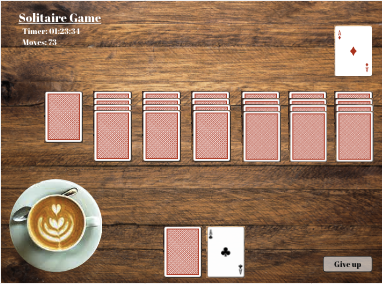
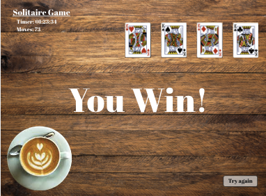
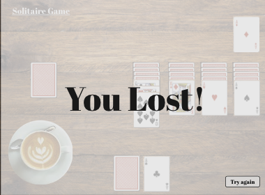

# Game: Solitaire With Cards

## Overview
Solitaire goes back to my childhood vacations, those rainy days at the beach house. This game simulates a solitaire with cards from the comfort of your home.

## Getting Started

here goes the link to the game

## Technologies
- HTML
- CSS
- JavaScript

### User Stories

MVP - Minimum Viable Product
(The leaste amount of work required to release a prototype of our app)

As a user, I want to be able to...

- click the main deck of cards and see the card on top
- start a foundation with an ace
- stack cards by dragging and dropping. 
    - A card can only be stacked on a card that is a different color and one number higher
    - A stack of cards can only be stacked on a card that is a different color and one number higher to the bottom card of the pile.
- display a message for invalid moves
- drag and drop a king into an empty space 
- win once all cards are stacked in order and in four different stack of cards. The king must be the last one.
- loose when when you give up
- reset any time I want
- play again after the game is over

**Bonus User Stories**
(These features would be nice to have if I have time to build them)
- count moves
- add set of rules
- drag and drop feature
- loose if it is impossible to make any other move
- Option to choose an easy game (1 card) or hard game (3 cards) 
- keep track of how many moves the player made in previous games
- help button to give me a possible move

## Overall design (look and feel) of the app

- clean, minimalisr design(layout)
- green background like a casino table
- classic cards

## UI WireFrame
<!-- add an image to the readme -->

- starts with seven piles of cards:
    - pile1: 1 card facing up
    - pile2: 1 card facing down and 1 facing up
    - pile3: 2 cards facing down and 1 facing up
    - pile4: 3 cards facing down and 1 facing up
    - pile5: 4 cards facing down and 1 facing up
    - pile6: 5 cards facing down and 1 facing up
    - pile7: 6 cards facing down and 1 facing up
    - pile8: Main deck rest of the cards (52 - 26 = 24)
- see the next card of the stack when I remove the one on top